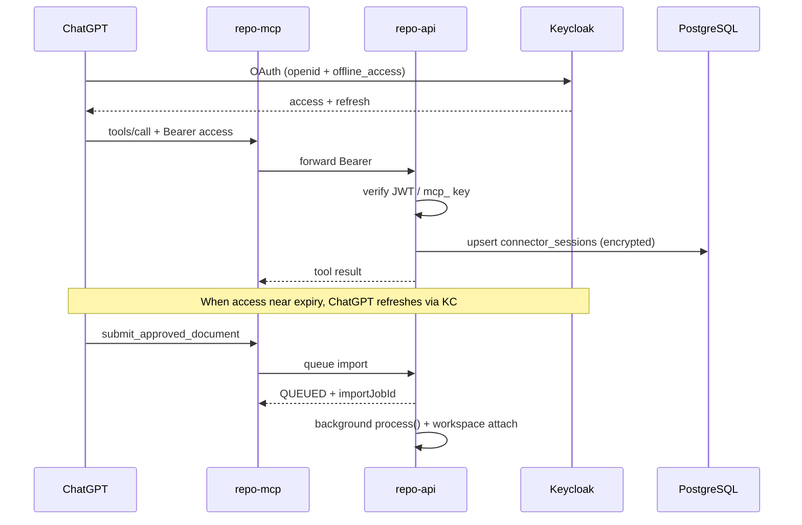

# Connector session lifecycle (ChatGPT Mode B)

This document explains how Physical Risk Repository authentication stays stable during ChatGPT connector operations, and which environment variables matter.

## Root cause of “tool unavailable” after workspace create

Mode B flow:

```
ChatGPT → https://repo.physicalrisk.com/connector/mcp
       → nginx → repo-mcp:3100 (forwards Bearer)
       → repo-api /api/mcp/tools/* (validates Keycloak JWT or mcp_ key)
```

Observed failure mode:

1. ChatGPT creates a workspace successfully.
2. Later `submit_approved_document` (PDF render + import) ran **synchronously** and could exceed nginx/`proxy_read_timeout` (120s).
3. ChatGPT collapsed the timed-out / 401 response into a vague “repository tool unavailable”.
4. Access tokens are short-lived; Keycloak refresh belongs to ChatGPT (`offline_access`). The API previously only returned a generic auth failure when `exp` passed.

## What we changed

| Area | Behaviour |
|------|-----------|
| Async imports | `submit_approved_document` stages the file, returns `status: QUEUED` + `importJobId` immediately, then processes in a background worker. |
| Token expiry | Guard rejects expired JWTs with `ACCESS_TOKEN_EXPIRED` (`retryable: true`). Sessions persist encrypted tokens in PostgreSQL. |
| Server-side refresh | If a refresh token was registered (`POST /api/connector/session/register-refresh`), `getValidAccessToken` / heartbeat refresh via Keycloak. ChatGPT normally refreshes client-side. |
| Idempotency | `Idempotency-Key` header or `idempotencyKey` body field on writes. |
| Import jobs | `POST/GET/POST …/retry` under `/api/import-jobs`. |
| Session status | `GET /api/connector/session/status`, `POST /api/connector/session/heartbeat`. |
| Health | `/api/health`, `/api/health/auth`, `/database`, `/storage`, `/import-worker`. |
| Nginx | `proxy_connect_timeout 30s`; send/read `120s`; keepalive `75s`. Long imports are **not** fixed by raising timeouts alone. |

**Important:** Creating a workspace never means a document was imported. Poll `get_import_status` / `GET /api/import-jobs/:jobId` until `IMPORTED` / `COMPLETED`.

## Session lifecycle



### When users must sign in again

Only when:

- Refresh token is expired / revoked (`REFRESH_TOKEN_EXPIRED`, `REFRESH_TOKEN_INVALID`)
- Session revoked (`CONNECTOR_SESSION_REVOKED`)
- No session and no valid Bearer (`CONNECTOR_SESSION_NOT_FOUND` / `MCP_AUTH_FAILED`)

Temporary Keycloak or API outages return `KEYCLOAK_UNAVAILABLE` / `REPOSITORY_API_UNAVAILABLE` with `retryable: true` and **do not** require login.

## Structured error shape

```json
{
  "success": false,
  "errorCode": "ACCESS_TOKEN_EXPIRED",
  "message": "The access token expired…",
  "retryable": true,
  "requiresLogin": true,
  "requestId": "req-…"
}
```

Supported codes include: `ACCESS_TOKEN_EXPIRED`, `REFRESH_TOKEN_EXPIRED`, `REFRESH_TOKEN_INVALID`, `CONNECTOR_SESSION_NOT_FOUND`, `REPOSITORY_API_UNAVAILABLE`, `CONNECTOR_REQUEST_TIMEOUT`, `KEYCLOAK_UNAVAILABLE`, `DATABASE_UNAVAILABLE`, `STORAGE_UNAVAILABLE`.

## Endpoints

| Method | Path | Purpose |
|--------|------|---------|
| GET | `/api/connector/session/status` | Connection + auth status (no tokens) |
| POST | `/api/connector/session/heartbeat` | Touch session; optional refresh; dependency checks |
| POST | `/api/connector/session/register-refresh` | Store refresh token for server-side refresh |
| POST | `/api/import-jobs` | Create multi-doc batch job |
| GET | `/api/import-jobs/:jobId` | Poll batch (`IMP-YYYY-#####`) |
| POST | `/api/import-jobs/:jobId/retry` | Re-queue batch |
| GET | `/api/health/*` | Auth / DB / storage / import-worker |

## Keycloak review (recommended, not permanent tokens)

| Setting | Guidance |
|---------|----------|
| Access token lifespan | 5–15 minutes |
| Refresh / offline token | Hours–days with rotation |
| SSO session idle / max | Align with org policy (e.g. 30m idle / 10h max) |
| Client | `repo-chatgpt-app`, public + PKCE |
| Scopes | `openid profile email offline_access` |
| Valid redirect URIs | `https://chatgpt.com/connector/oauth/*` |
| Web origins | `https://chatgpt.com` |
| Refresh rotation | ON |
| Offline access | Required for ChatGPT’s refresh behaviour |

Do **not** make access tokens permanent.

## Environment variables

| Variable | Service | Purpose |
|----------|---------|---------|
| `KEYCLOAK_ENABLED` | repo-api | Enable JWT auth for MCP |
| `KEYCLOAK_ISSUER` | repo-api, repo-mcp | Token issuer / refresh endpoint base |
| `KEYCLOAK_JWKS_URL` | repo-api | Signature verification |
| `KEYCLOAK_CLIENT_ID` / `REPO_MCP_CLIENT_ID` | api / mcp | Prefer `repo-chatgpt-app` for connector |
| `REPO_MCP_CLIENT_SECRET` | repo-api | Only if confidential client |
| `CONNECTOR_ENCRYPTION_KEY` | repo-api | AES-256 key for session tokens (32 bytes hex/base64) |
| `REPO_API_URL` | repo-mcp | Upstream API (`http://repo-api:4000/api`) |
| `PUBLIC_MCP_URL` | repo-mcp | Public connector base URL |
| `MCP_OAUTH_REQUIRED` | repo-mcp | Challenge unauthenticated tool calls |
| `REPO_MCP_API_KEY` | repo-mcp | Optional service `mcp_` key |
| `REPO_MCP_REQUEST_TIMEOUT_MS` | repo-mcp | Outbound timeout (default 120000) |
| `STORAGE_ROOT` / `REPO_STORAGE_ROOT` | repo-api | Storage health check |
| `DATABASE_URL` | repo-api | Session + import persistence |

## Logging

Every connector request should log (never tokens/secrets):

`requestId`, `sessionId`, `userId`, `operation`, `workspaceCode`, `jobId`, HTTP status, token expiry time, whether refresh occurred, retry count, duration, error code, container instance, timestamp.
