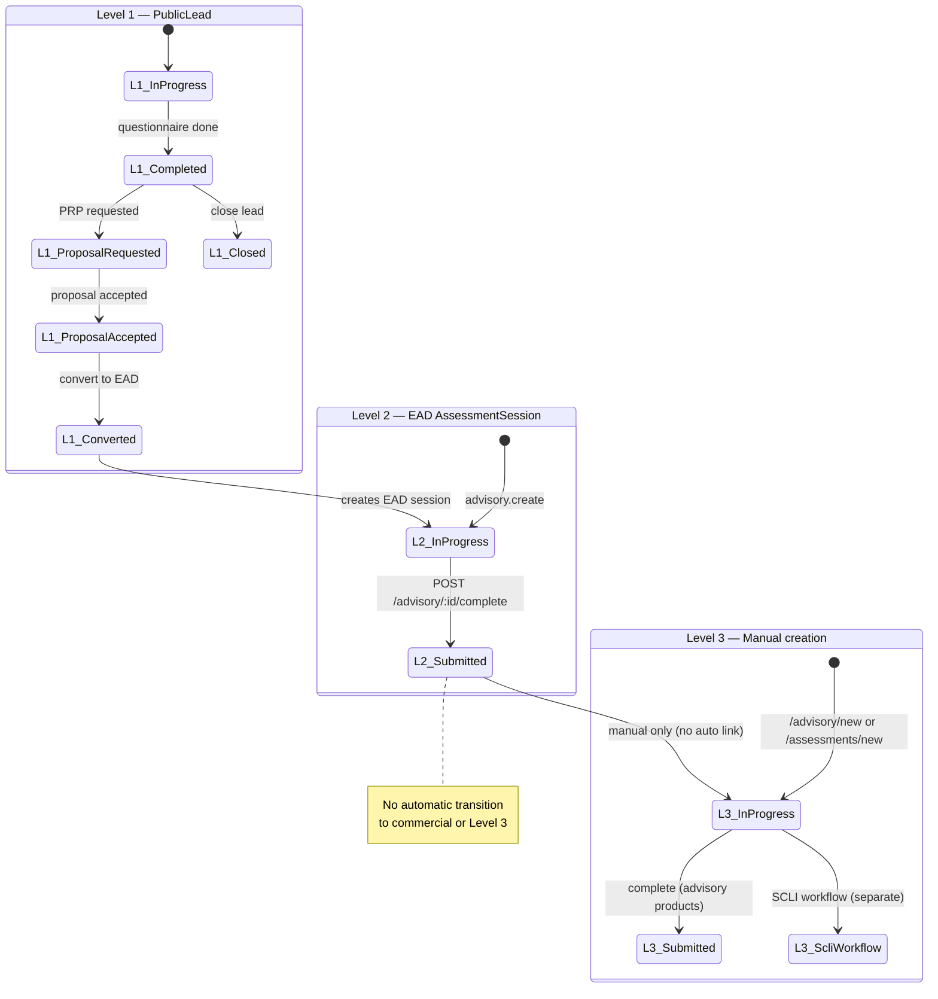

# Executive Advisory Diagnostic → Level 3 Routing Audit

**Audit date:** 2026-08-25  
**Scope:** Read-only inspection of EAD completion (“Complete diagnostic & confirm routing”) and downstream Level 3 / commercial journey.  
**No code, schema, UI, routing, or deployment changes were made.**

---

## Executive Summary

The Physical Risk product journey from **Level 1 (EGT)** through **Level 2 (EAD)** is **partially implemented**. EGT → PRP → EAD conversion preserves separate records and references. Level 2 diagnostic work is captured in six consultant-led **AdvisoryModuleReview** rows per EAD engagement.

The **“Complete diagnostic & confirm routing”** action exists and performs **minimal completion**: it validates three text fields per module, sets the EAD `AssessmentSession` status to `SUBMITTED`, and returns a deduplicated list of manually selected `recommendedProduct` values. It does **not** implement a governed post-completion journey.

**Critical gaps vs intended architecture:**

| Intended step | Status |
|---|---|
| EGT → commercial → EAD | **IMPLEMENTED** (via `PublicLead` + `triage.convert`) |
| EAD module diagnostic work | **PARTIAL** (modules exist; evidence upload optional) |
| Rules-based Level 3 recommendation engine | **MISSING** (manual dropdown only) |
| Consultant routing confirmation workflow | **PARTIAL** (implicit in module save + complete click) |
| Dedicated diagnostic outcome screen | **MISSING** |
| EAD-level commercial / PRP handoff | **MISSING** (PRP exists only on Level 1 `PublicLead`) |
| Client acceptance before Level 3 | **MISSING** (no EAD-linked acceptance flow) |
| Governed Level 3 engagement creation | **PARTIAL** (manual creation only; no auto-start on complete) |
| Level 2 diagnostic report on completion | **PARTIAL** (separate “Generate PDF report” action) |
| Audit event for EAD completion | **MISSING** |
| Consultant-only RBAC on completion | **INCORRECT** (org members can complete; no `INTERNAL_ROLES` check) |

**LEVEL 3 AUTO-CREATION BEFORE ACCEPTANCE: NO** — completing an EAD does not create Level 3 engagements.

**OVERALL PRODUCT JOURNEY: PARTIAL** — record separation is sound; governed L2→L3→commercial workflow is not.

---

## Current Implemented Flow

```
Public website /start
  → PublicLead + AssessmentSession (EXECUTIVE_GOVERNANCE_TRIAGE, ref EGT-YYYY-xxxxxx)
  → Questionnaire completed, scored (Level 1 indication only)

Commercial (Level 1 only)
  → Client requests proposal → PublicLead.proposalReference (PRP-YYYY-xxxxxx)
  → Internal proposal workflow on PublicLead (REQUESTED → … → ACCEPTED)
  → CRM: EspoCRM lead sync (ESPO_SYNC_LEAD) — tied to PublicLead, not EAD

Level 2 initiation
  → Triage “Convert to Level 2” → AdvisoryService.create(EXECUTIVE_ADVISORY_DIAGNOSTIC)
  → New AssessmentSession (EAD-YYYY-xxxxxx), parentAssessmentId = EGT assessment
  → PublicLead.convertedAssessmentId + convertedAt set; EGT record unchanged

Level 2 work
  → Consultant edits 6 AdvisoryModuleReview rows on /advisory/[id]
  → Optional: assign PRIMARY_ANALYST, upload evidence (generic EvidenceDocument — not required for completion)
  → Optional: Generate PDF report (EXECUTIVE_ADVISORY_BRIEF)

Level 2 completion
  → “Complete diagnostic & confirm routing” → POST /advisory/:id/complete
  → Status → SUBMITTED; returns recommendedProducts[] from module dropdowns
  → No further automated steps

Level 3 (manual only)
  → Consultant uses /advisory/new (focused assurance products) or /assessments/new (SCLI)
  → New AssessmentSession with product-specific reference (SCL-, CSLA-, VPA-, SGEA-, CPD-, SH360-)
  → parentAssessmentId not auto-linked from EAD recommendations
```

---

## "Complete diagnostic & confirm routing" Execution Trace

### Frontend

| Item | Location |
|---|---|
| Button label | `moss/apps/web/app/advisory/[id]/page.tsx` — `complete()` handler, button text at ~line 300 |
| Click handler | `complete()` (~lines 153–177) |
| Pre-save | Calls `persistModules(modules)` — PATCH each module to API |
| Client validation | `incompleteModules()` — requires `finding`, `businessConsequence`, `requiredDecision` per module |
| API call | `POST /advisory/${id}/complete` via `apiFetch` |
| Post-success UI | Green `PRAlert` notice with routed product codes; `load()` refresh; **no redirect** |
| Button state | Disabled only while `busy`; **not** disabled when status is already `SUBMITTED` |

### API

| Item | Location |
|---|---|
| Route | `POST /advisory/:id/complete` |
| Controller | `moss/apps/api/src/advisory/advisory.controller.ts` → `complete()` → `service.completeDiagnostic()` |
| Service | `moss/apps/api/src/advisory/advisory.service.ts` → `completeDiagnostic()` (~lines 191–199) |
| Guards | `JwtAuthGuard`, `RolesGuard` — **no `@Roles()` decorator** on controller methods |
| Access check | `assertAccess()` only — internal roles **or** organisation membership |

### Database transaction

**None.** Single `assessmentSession.update` — not wrapped in `$transaction` with other side effects.

### What the code actually does (checklist)

| Step | Happens? | Detail |
|---|---|---|
| A. Validates diagnostic completion | **YES (partial)** | All modules must have non-empty `finding`, `businessConsequence`, `requiredDecision`. Does **not** require `evidenceSummary`, `exposureRating`, `recommendedProduct`, uploaded evidence, or findings/recommendation records. |
| B. Calculates/reads diagnostic outcome | **PARTIAL** | Reads existing `AdvisoryModuleReview` rows only; no outcome aggregate entity. |
| C. Determines Level 3 recommendations | **NO (manual only)** | Collects `recommendedProduct` already set per module by consultant; no rules engine. |
| D. Asks consultant to confirm routing | **PARTIAL** | Button label implies confirmation; no separate review/confirm UI or diff vs system suggestion. |
| E. Saves confirmed recommendations | **PARTIAL** | Recommendations already saved on modules via PATCH before complete; complete does not persist a separate “confirmed routing” record. |
| F. Marks EAD complete | **YES** | Sets `status: SUBMITTED`, `submittedAt: now()`. Does **not** set `REVIEWED`, `APPROVED`, `REPORT_ISSUED`, or `CLOSED`. |
| G. Creates commercial follow-up | **NO** | No PRP/proposal/opportunity created at EAD level. |
| H. Creates Level 3 engagement records | **NO** | No `assessmentSession.create` for Level 3 products. |
| I. Generates diagnostic report | **NO** | Report is separate `POST /advisory/:id/generate-report`. |
| J. Writes audit events | **NO** | Unlike `ADVISORY_CREATED`, `ADVISORY_MODULE_UPDATED`, `ADVISORY_REPORT_GENERATED`, completion writes **no** audit row. |
| K. Sends notifications | **NO** | No email/CRM trigger in `completeDiagnostic`. |

### Return payload

```json
{ "ok": true, "status": "SUBMITTED", "recommendedProducts": ["SCLI_COST_LEAKAGE", "..."] }
```

`recommendedProducts` is a deduplicated array of `ProductCode` values from modules where `recommendedProduct` is set. Empty selection is allowed.

---

## Completion Validation

**COMPLETION VALIDATION: PARTIAL**

### Required for completion (enforced client + server)

- All `AdvisoryModuleReview` rows for the engagement must have:
  - `finding` (non-empty trim)
  - `businessConsequence` (non-empty trim)
  - `requiredDecision` (non-empty trim)

### Not required for completion

- `evidenceSummary` (text field)
- `exposureRating`
- `accountableExecutive`
- `analystNote`
- `recommendedProduct` (Level 3 route can be “none recorded”)
- Uploaded `EvidenceDocument` files
- `Finding` or `Recommendation` table rows
- Primary consultant assignment
- Generated report
- Prior status check (can complete from `IN_PROGRESS` or re-complete from `SUBMITTED`)

### What prevents incomplete diagnostic from completing

- Missing any of the three required text fields on any module → `BadRequestException` with module names (API) or client-side error before POST.

---

## Permissions / Consultant Controls

**CONSULTANT ROUTING CONFIRMATION (RBAC): PARTIAL / INCORRECT**

| Action | Who can execute (code) |
|---|---|
| Create EAD / Level 3 engagement | `INTERNAL_ROLES` only (`advisory.create`) |
| Update modules | `INTERNAL_ROLES` only (`updateModule`) |
| Assign consultant | `INTERNAL_ROLES` only (`assign`) |
| Generate report | `INTERNAL_ROLES` only (`generateReport`) |
| **Complete diagnostic** | **Any user passing `assertAccess`** — internal staff **or** client org member with `Membership` |

There is **no** validation that the actor is the assigned `PRIMARY_ANALYST`. Assignment is optional UI-only.

**Roles that can complete today:** `SUPER_ADMIN`, `METHODOLOGY_ADMIN`, `ANALYST`, `REVIEWER`, `SALES`, `AUDITOR` (internal), plus `CLIENT_EXECUTIVE` / `CLIENT_CONTRIBUTOR` if they belong to the engagement’s organisation.

---

## Diagnostic Outcome

**DIAGNOSTIC OUTCOME SCREEN: MISSING**

- No dedicated route (e.g. `/advisory/[id]/outcome`, `/advisory/[id]/routing`).
- After completion, user remains on `/advisory/[id]` with status badge `Submitted` and a success notice listing product codes.
- No consolidated view of: confirmed outcome, priority, rationale, commercial next step, or linked Level 3 engagements.

---

## Level 3 Recommendation Engine

**LEVEL 3 RECOMMENDATIONS: PARTIAL** (manual selection only)

### Mechanism

- Each EAD module (`AdvisoryModuleReview`) has optional `recommendedProduct: ProductCode?`.
- Consultant selects from dropdown in `ModuleEditor` (`ROUTES` constant in `advisory/[id]/page.tsx`).
- No automated rules, thresholds, domain scoring, or questionnaire replay from Level 1.
- No use of `RecommendationRule` / `Recommendation` models for EAD routing.

### Configured Level 3 / sustainable product codes (from shared + UI)

| ProductCode | Display name (UI) | Reference prefix |
|---|---|---|
| `SCLI_COST_LEAKAGE` | Security Cost Leakage Assessment™ | `SCL-YYYY-xxxxxx` |
| `CONTRACT_SLA_ASSURANCE` | Contract & SLA Assurance Review | `CSLA-YYYY-xxxxxx` |
| `VENDOR_PERFORMANCE_ASSURANCE` | Vendor Performance Assurance Review | `VPA-YYYY-xxxxxx` |
| `GOVERNANCE_EXECUTIVE_ASSURANCE` | Security Governance & Executive Assurance Review | `SGEA-YYYY-xxxxxx` |
| `CYBER_PHYSICAL_DEPENDENCY` | Cyber-Physical Dependency Review | `CPD-YYYY-xxxxxx` |
| `SHIELD360` | Shield 360 | `SH360-YYYY-xxxxxx` |

Source: `moss/packages/shared/src/product-architecture.ts`, `moss/apps/api/src/common/assessment-reference.ts`, `advisory/[id]/page.tsx` `ROUTES`.

Note: `SCLI_COST_LEAKAGE` is created via `/assessments` API, not `/advisory`, when using `/advisory/new`.

---

## Consultant Routing Confirmation

**CONSULTANT ROUTING CONFIRMATION: PARTIAL**

| Capability | Implemented? |
|---|---|
| System recommendation | **NO** — no system-generated routing list |
| Consultant review | **YES** — per-module working papers |
| Accept recommendation | **N/A** |
| Remove recommendation | **YES** — clear dropdown to “No focused product selected” |
| Add appropriate product | **YES** — manual dropdown per module |
| Set priority | **NO** — no priority field on routing |
| Add rationale | **PARTIAL** — `analystNote` per module; not routing-specific |
| Confirm routing | **PARTIAL** — single “Complete diagnostic & confirm routing” click; no locked confirmation record |

There is no immutable “confirmed routing snapshot” separate from live module edits after completion.

---

## Commercial Handoff

**COMMERCIAL HANDOFF: MISSING** (at Level 2)

### What exists (Level 1 only)

- `PublicLead.proposalReference` (`PRP-YYYY-xxxxxx`) — `generateProposalReference()`
- `PublicLead.proposalStatus` workflow — `triage.service.proposalAction()`
- Public proposal request — `public.service.requestProposal()`
- CRM lead sync — `espocrm.service` / `ESPO_SYNC_LEAD` on `PublicLead` capture and updates
- Triage UI Commercial tab and PRP journey on `PublicLead`

### What does not exist for EAD

- No `proposalReference` or proposal status on `AssessmentSession`
- No “Prepare Level 3 Proposal” action after EAD completion
- No EAD → opportunity / PRP creation in `completeDiagnostic`
- No client acceptance gate tied to EAD recommendations
- `espocrmOpportunityId` on `AssessmentSession` exists in schema but is **not** populated by advisory completion code

**CLIENT ACCEPTANCE: MISSING** (for Level 3 path after EAD)

Level 1 client acceptance (`ProposalStatus.ACCEPTED` on `PublicLead`) gates triage → EAD conversion in practice, but there is **no** parallel acceptance workflow for Level 3 services identified at EAD completion.

---

## Proposal / Acceptance Flow

| Stage | Level 1 (EGT/PRP) | Level 2 (EAD) | Level 3 |
|---|---|---|---|
| Proposal record | `PublicLead` + PRP ref | None | None |
| Proposal status enum | `ProposalStatus` on lead | N/A | N/A |
| Client request | `/request-proposal` token flow | N/A | N/A |
| Internal mark sent/accepted | Triage Commercial tab | N/A | N/A |
| Conversion trigger | `triage.convert` after triage complete | N/A | Manual engagement create |

---

## Level 3 Engagement Creation

**LEVEL 3 ENGAGEMENT CREATION: PARTIAL**

### When created

- **Manually** by internal user via:
  - `/advisory/new` → `POST /advisory` (focused assurance product codes except SCLI)
  - `/advisory/new` with SCLI → `POST /assessments` (SCLI workflow)
- **Not** triggered by EAD completion
- **Not** triggered by PRP acceptance alone (PRP acceptance does not auto-create Level 3)

### Reference formats

Generated by `generateAssessmentReference()` in `assessment-reference.ts` (see table above).

### Linking to EAD

- `AssessmentSession.parentAssessmentId` optional on create
- Triage conversion sets EAD.`parentAssessmentId` = EGT assessment id
- **No code** auto-sets Level 3.`parentAssessmentId` = EAD when creating from recommendations
- `CreateAdvisoryDto.parentAssessmentId` exists but `/advisory/new` UI does **not** expose it

---

## Multiple Product Support

**MULTIPLE RECOMMENDATIONS: PARTIAL**

### Data model

- **One row per diagnostic module** in `AdvisoryModuleReview` (unique `[assessmentId, moduleCode]`)
- Each row may hold one `recommendedProduct`
- Up to **6 modules** → up to 6 recommendations; `completeDiagnostic` deduplicates to unique product codes
- **Not** stored as JSON blob or separate routing join table
- **Not** stored in `Recommendation` table for EAD

### Auto-creation of all recommended products

**NO** — recommendations remain metadata on module rows until a human creates engagements separately.

### Priority per product

**MISSING** — no HIGH / RECOMMENDED labels in schema or UI for routing.

---

## Diagnostic Report

**LEVEL 2 DIAGNOSTIC REPORT: PARTIAL**

| Item | Status |
|---|---|
| Template | `moss/apps/api/src/advisory/advisory-report-pdf.ts` |
| Report type | `ReportType.EXECUTIVE_ADVISORY_BRIEF` for EAD |
| Trigger | Manual `POST /advisory/:id/generate-report` — **not** on complete |
| Validation | Same three required fields per module as completion |
| Storage | MinIO via `StorageService`; `Report` row with `ReportStatus.GENERATED` |
| PDF content | Organisation, reference, consultant, all modules incl. `recommendedProduct` |
| Approval / issue | Schema supports `APPROVED`, `ISSUED`; advisory flow does not implement issue workflow |
| Client send | No automated client delivery on complete |
| Audit | `ADVISORY_REPORT_GENERATED` |

UI: “Generate PDF report” + “Open latest report” link to `/reports/[id]`.

---

## Audit Trail

**AUDIT TRAIL: PARTIAL**

### Events that exist (relevant journey)

| Action | When |
|---|---|
| `PUBLIC_LEAD_CAPTURED` | EGT start |
| `PUBLIC_TRIAGE_COMPLETED` | EGT questionnaire done |
| `PROPOSAL_REQUESTED`, `PROPOSAL_*` | Level 1 commercial |
| `TRIAGE_CONVERTED_TO_LEVEL2` | EAD created from triage |
| `ADVISORY_CREATED` | EAD or Level 3 advisory created |
| `ADVISORY_MODULE_UPDATED` | Module PATCH |
| `ADVISORY_ASSIGNED` | Consultant assigned |
| `ADVISORY_REPORT_GENERATED` | PDF generated |

### Missing events (expected capability)

| Event | Status |
|---|---|
| EAD started | **MISSING** (only `ADVISORY_CREATED` + status IN_PROGRESS) |
| **EAD completed / routing confirmed** | **MISSING** |
| Level 3 recommendations confirmed | **MISSING** |
| Level 3 proposal created (post-EAD) | **MISSING** |
| Level 3 proposal accepted | **MISSING** |
| Level 3 engagement created (from EAD routing) | **MISSING** (only generic `ADVISORY_CREATED` if manually created) |

Journey UI on triage (`commercialJourney`, audit tab) covers Level 1; EAD detail has **no** journey/audit tab.

---

## Duplicate Protection

**DUPLICATE PROTECTION: PARTIAL**

| Scenario | Protection |
|---|---|
| Double-click complete | **WEAK** — repeated POST re-sets `SUBMITTED` / `submittedAt`; no idempotency key |
| API retry on complete | Same as above |
| Return to completed EAD | UI allows complete again; modules still editable |
| Triage convert twice | **YES** — returns existing engagement if `convertedAssessmentId` set |
| Duplicate PRP | **PARTIAL** — `proposalReference` unique; `requestProposal` checks existing |
| Duplicate Level 3 from complete | **N/A** — complete does not create Level 3 |
| Duplicate audit on complete | **N/A** — no audit written |

---

## Actual State Machine

### PublicLead (Level 1 commercial shell)

**Fields:** `status`, `proposalStatus`, `completedAt`, `convertedAt`, `closedAt`, etc.  
**Not a formal enum state machine** — derived `displayStatus` / `intent` in `triage.service.ts`.

Typical progression:

```
IN_PROGRESS → (completedAt set) → COMPLETED / REVIEWED / CONTACTED
proposalStatus: NOT_REQUESTED → REQUESTED → IN_PREPARATION → SENT → ACCEPTED
convertedAt set → CONVERTED (EAD linked)
closedAt set → CLOSED
```

### AssessmentSession — EAD (Level 2)

**Enum:** `AssessmentStatus` in schema.

Observed EAD lifecycle in code:

```
DRAFT (default schema; advisory create uses IN_PROGRESS)
  ↓
IN_PROGRESS  (advisory.service.create)
  ↓
SUBMITTED    (completeDiagnostic — sets submittedAt)
```

**Not used by EAD completion path:** `REVIEWED`, `APPROVED`, `REPORT_GENERATED`, `REPORT_ISSUED`, `CLOSED`, `ARCHIVED`, and legacy pilot statuses.

There are **no** states named `ROUTING_REVIEW`, `COMMERCIAL_PENDING`, or `COMMERCIAL_ACCEPTED` in schema or advisory code.

### AssessmentSession — Level 3 (SCLI / focused assurance)

- SCLI: full workflow via `assessments.service` / `workflow.service` (separate audit)
- Other Level 3 advisory products: created `IN_PROGRESS`; completion uses same `completeDiagnostic` → `SUBMITTED`

### State diagram (actual)



---

## Expected vs Actual Journey

| Step | Expected | Actual |
|---|---|---|
| Level 1 EGT | Complimentary triage, not an assessment | **IMPLEMENTED** — `EXECUTIVE_GOVERNANCE_TRIAGE`, separate from SCLI |
| EGT → commercial | PRP / proposal request | **IMPLEMENTED** — on `PublicLead` only |
| Commercial → EAD | After acceptance / conversion | **IMPLEMENTED** — `triage.convert` → `EAD-*` |
| EAD consultant work | Evidence-led diagnostic | **PARTIAL** — module papers; evidence upload optional |
| Determine Level 3 routes | Rules + consultant judgement | **PARTIAL** — consultant judgement only (dropdown) |
| Confirm routing | Explicit confirmation step | **PARTIAL** — complete button only |
| EAD complete | Mark complete, preserve record | **PARTIAL** — SUBMITTED; no audit; weak RBAC |
| Diagnostic outcome screen | Dedicated summary | **MISSING** |
| Commercial proposal for Level 3 | Post-EAD PRP/proposal | **MISSING** |
| Client acceptance | Before Level 3 start | **MISSING** (post-EAD) |
| Level 3 engagement | After acceptance, selected products | **PARTIAL** — manual create only |
| No premature Level 3 | No auto-start on EAD complete | **IMPLEMENTED** — no auto-creation |
| Level 2 report | Diagnostic report | **PARTIAL** — manual generate |
| Record separation EGT/EAD/L3 | Distinct linked records | **IMPLEMENTED** |
| Audit lifecycle | Full event history | **PARTIAL** — gaps at EAD complete and L3 commercial |

---

## Gaps

1. **No EAD completion audit event** — cannot prove routing confirmation in audit trail.
2. **No consultant-only RBAC on complete** — client org members can submit completion.
3. **No dedicated diagnostic outcome / routing screen** after completion.
4. **No EAD-level commercial workflow** — Level 3 proposal/acceptance not modelled after diagnostic.
5. **No rules-based recommendation engine** — routing is per-module manual dropdown only.
6. **No priority or confirmed routing snapshot** — cannot represent “HIGH vs RECOMMENDED” product list.
7. **No client acceptance gate** before Level 3 engagement creation (post-EAD).
8. **No automatic parent link** from Level 3 engagement back to source EAD when created manually.
9. **Completion validation is thin** — evidence, routing selection, assignment, and report not required.
10. **Re-completion allowed** — no idempotency or lock after `SUBMITTED`.
11. **Finding / Recommendation models unused** for EAD routing (parallel structures exist for SCLI/MOSS).
12. **CRM integration stops at Level 1 lead** for proposal journey; EAD completion does not sync routing outcomes.

---

## Risks

| Risk | Severity | Notes |
|---|---|---|
| Client completes EAD without consultant | High | RBAC gap on `completeDiagnostic` |
| Routing recorded as “none” while marked complete | Medium | `recommendedProduct` optional |
| Consultant creates Level 3 without commercial acceptance | Medium | Manual `/advisory/new` has no acceptance check |
| Audit gap on completion | Medium | Compliance / governance traceability |
| Duplicate completion overwrites `submittedAt` | Low | Weak idempotency |
| Perceived “confirm routing” vs actual save | Medium | No immutable confirmation artefact |
| SCLI vs advisory split confuses operators | Low | Two creation paths for Level 3 products |

---

## Recommended Implementation Order

*(For future work — not executed in this audit.)*

1. **RBAC** — Restrict `completeDiagnostic` to `INTERNAL_ROLES`; optionally require `PRIMARY_ANALYST`.
2. **Audit** — Add `ADVISORY_DIAGNOSTIC_COMPLETED` with `recommendedProducts` metadata.
3. **Idempotency** — Reject or no-op if already `SUBMITTED`; optionally lock module edits after completion.
4. **Validation** — Require `recommendedProduct` where routing is mandatory; require evidence or explicit “limitation recorded”.
5. **Confirmed routing entity** — Snapshot table or JSON on EAD at completion (products, priority, rationale, confirmedBy, confirmedAt).
6. **Diagnostic outcome UI** — Dedicated screen/route post-completion with commercial CTAs.
7. **EAD commercial workflow** — PRP/proposal model linked to EAD (or child commercial records), mirroring Level 1 pattern.
8. **Client acceptance gate** — Block Level 3 `create` until commercial acceptance (or explicit admin override).
9. **Level 3 create from EAD** — Wizard pre-filled from confirmed routing; set `parentAssessmentId` to EAD.
10. **CRM / notifications** — Sync routing outcome and commercial milestones.
11. **Optional rules assist** — Suggest products from module codes / exposure ratings; consultant confirms.

---

## Files Inspected

| Path | Purpose |
|---|---|
| `moss/apps/web/app/advisory/[id]/page.tsx` | Completion button, module UI, routing dropdown |
| `moss/apps/web/app/advisory/new/page.tsx` | Manual Level 2/3 creation |
| `moss/apps/web/app/advisory/page.tsx` | Advisory list |
| `moss/apps/api/src/advisory/advisory.controller.ts` | REST endpoints |
| `moss/apps/api/src/advisory/advisory.service.ts` | Core EAD logic, complete, report |
| `moss/apps/api/src/advisory/advisory-report-pdf.ts` | Level 2 PDF template |
| `moss/apps/api/src/triage/triage.service.ts` | EGT→EAD convert, PRP workflow |
| `moss/apps/api/src/triage/triage.controller.ts` | Triage convert endpoint |
| `moss/apps/api/src/public/public.service.ts` | EGT capture, PRP request |
| `moss/apps/api/src/common/assessment-reference.ts` | EGT/EAD/Level 3 reference prefixes |
| `moss/apps/api/src/common/proposal-reference.ts` | PRP reference generation |
| `moss/apps/api/src/common/roles.ts` | RBAC role sets |
| `moss/apps/api/src/common/roles.guard.ts` | Roles guard behaviour |
| `moss/apps/api/prisma/schema.prisma` | Data model |
| `moss/packages/shared/src/product-architecture.ts` | Product levels, modules, codes |
| `moss/apps/web/app/triage/[id]/page.tsx` | Level 1 commercial / convert UI (context) |

---

**NO CODE CHANGES MADE: CONFIRMED**  
**NO DATABASE CHANGES MADE: CONFIRMED**  
**NO DEPLOYMENT MADE: CONFIRMED**

---

## Implementation Appendix (2026-08-25)

The governed EAD → Level 3 journey described in the recommended order above has been implemented. Audit status below reflects **post-implementation** state.

**Restored & redeployed locally 2026-08-26:** migration `20260825210000_ead_routing_outcome` applied; `moss-api` / `moss-web` rebuilt with outcome, commercial proposal, and create-engagement routes live.

| # | Recommendation | Status |
|---|---|---|
| 1 | RBAC on `completeDiagnostic` | **Done** — consultant/internal roles only |
| 2 | Audit event `ADVISORY_DIAGNOSTIC_COMPLETED` | **Done** |
| 3 | Idempotency + lock after completion | **Done** — `AdvisoryDiagnosticOutcome` snapshot; modules locked |
| 4 | Validation (finding, consequence, decision, evidence) | **Done** |
| 5 | Confirmed routing snapshot | **Done** — `AdvisoryConfirmedRoute` model |
| 6 | Diagnostic outcome UI | **Done** — `/advisory/[id]/outcome` |
| 7 | EAD commercial workflow (L3P) | **Done** — `POST /advisory/:id/commercial-proposal` |
| 8 | Client acceptance gate before L3 create | **Done** — `create-engagement` requires `ACCEPTED` |
| 9 | Level 3 create from EAD with `parentAssessmentId` | **Done** — `POST /advisory/:id/routes/:routeId/create-engagement` |
| 10 | CRM / notifications | **Not done** — out of scope |
| 11 | Rules-based routing assist | **Not done** — manual consultant confirmation retained |
| 12 | Manual L3 bypass blocked when EAD completed | **Done** — API + `/advisory/new` + `/assessments/new` |
| 13 | Client read-only outcome / commercial UI | **Done** — `permissions.canManageCommercial` |
| 14 | Report required before EAD complete | **Done** — API + UI gate |

### New / changed artefacts

| Area | Path |
|---|---|
| Schema | `moss/apps/api/prisma/schema.prisma` — `AdvisoryDiagnosticOutcome`, `AdvisoryConfirmedRoute`, `AdvisoryRoutePriority` |
| Migration | `moss/apps/api/prisma/migrations/20260825210000_ead_routing_outcome/` |
| Shared routing | `moss/packages/shared/src/ead-routing.ts` |
| L3P references | `moss/apps/api/src/common/l3-proposal-reference.ts` |
| API | `moss/apps/api/src/advisory/advisory.service.ts`, `advisory.controller.ts` |
| Outcome screen | `moss/apps/web/app/advisory/[id]/outcome/page.tsx` |
| EAD detail (routing + lock) | `moss/apps/web/app/advisory/[id]/page.tsx` |

### Manual test checklist

1. Complete an EAD with at least one module routing selection → redirected to outcome screen.
2. Initiate L3P commercial proposal → prepare → mark sent → accept.
3. Create Level 3 engagement from accepted route → verify `parentAssessmentId` links to EAD.
4. Confirm Level 3 cannot be created before commercial acceptance.
5. Re-submit complete → idempotent (no duplicate outcome).
