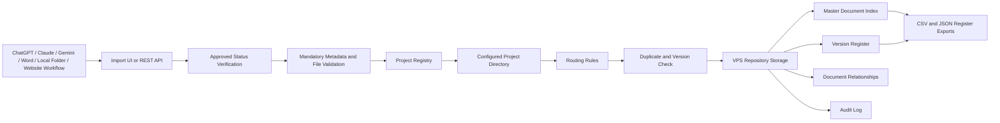

# RFP-001 MVP Architecture — VPS Repository

## Components

### Next.js frontend

- Approved-document upload and metadata confirmation.
- Import queue and result pages.
- Project Registry and directory-template configuration.
- VPS Repository Explorer.
- Master Document Index, Version Register, relationships and audit views.
- No project-specific routing logic is embedded in the frontend.

### NestJS API

- Enforces approved-only imports.
- Validates file extension, size and mandatory metadata.
- Resolves the project and destination section from configuration.
- Rejects duplicate checksums and invalid version progression.
- Stores immutable versions and maintains the current-version pointer.
- Generates repository register exports after each successful import.
- Serves controlled file downloads through authenticated API endpoints.

### PostgreSQL

- System of record for configuration, document identity, versions, relationships, imports, users and audit events.
- Relationships and version history remain valid even when section names or order change.
- Physical paths are stored as relative repository paths so the VPS mount can move without rewriting every record.

### VPS filesystem

- `storage/incoming` temporarily stages received files.
- `storage/repository/<project-root>/<section>/<document-code>/v<version>/` retains approved versions.
- Master Document Index and Version Register are exported as CSV and JSON into their configured project sections.
- The Docker host bind mount is the persistent repository layer.

### Nginx reverse proxy

- Routes `/api/*` to NestJS.
- Routes all other traffic to Next.js.
- Enforces a suitable upload-body limit for the MVP.

## Configuration-driven directory principle

The application reads `Project.repositoryRootPath` and `ProjectSection.relativePath`. Administrators can add, rename, deactivate and reorder sections without application redevelopment. Existing `DocumentVersion.storagePath` records and all database relationships are retained.
